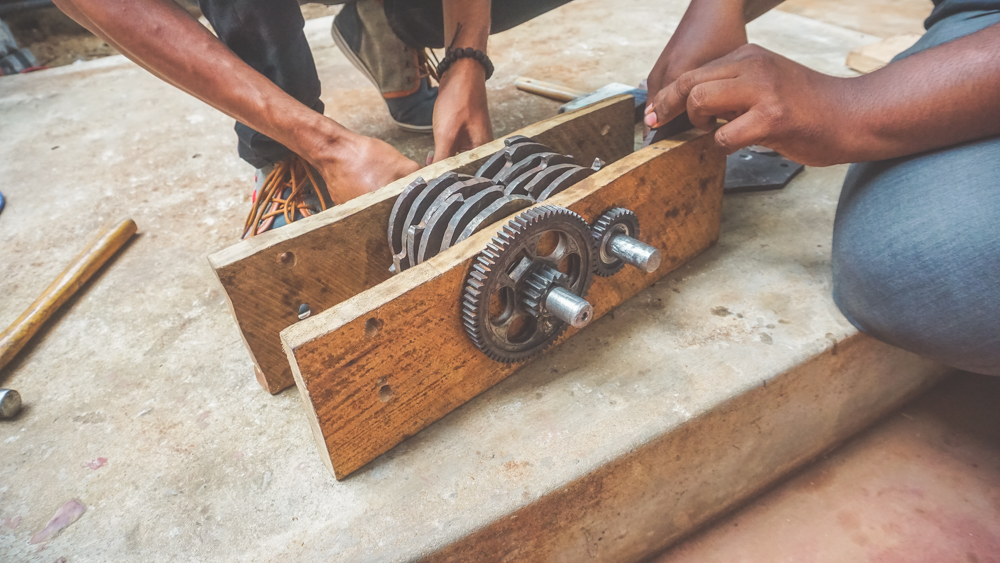
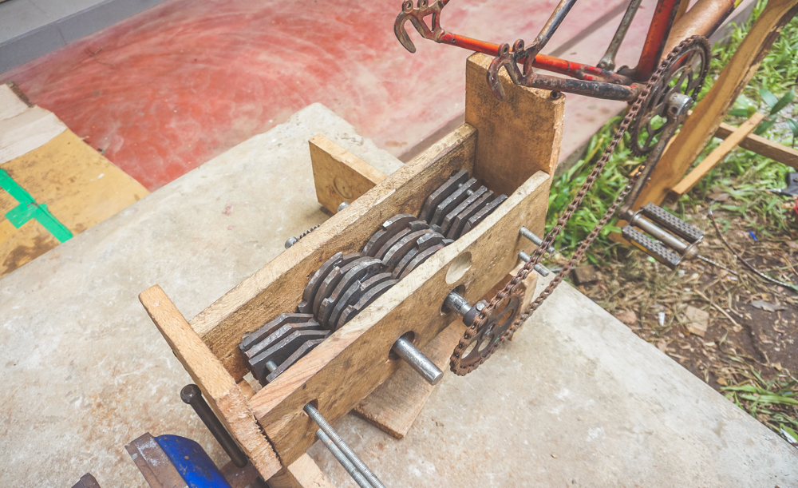

<h1>Circular Plastic</h1>

Community Innovation project of DreamSpace Academy to engage people with plastic awareness

 
 

<h2>Collaborators</h2>

<ul>
  <li>Jayanthan Amalanathan</li>
  <li>Aravinth Panch</li>
  <li>Abitharani Jeyachandran</li>
  <li>Jerushan Srikaran</li>
  <li>Thanushkar Srikaran</li>
  <li>Charles Grashiyan</li>
</ul>
 
 

<h2>Introduction</h2>

Since the revolutionary invention of the first synthetic polymer back in 1869 by John Wesley Hyatt, plastic manufacture has not been constrained by the limits of nature. The wide range of completely synthetic modern plastics started to be developed around a century ago, offering benefits not found in natural materials. With the countless possibilities of plastics, it was viewed as an abundant material that is inexpensive and safe, which could be shaped by humans to their desire.

Over the last 50 years, plastics have saturated our world, and at present play an important part in our day to day activities. It is cheap to produce, convenient, useful, durable, and found everywhere. This miracle material has made modern life convenient, at a very high cost of course, in terms of the environment, and has become a serious global menace. More than 40% of it is used just once, leading to plastic pollution, choking waterways and causing harm to many living beings in numerous ways. Single-use or disposable plastics such as plastic bags, straws, PET bottles and most food packaging, have an immense impact on the environment. These persist in the environment, degrading the soil and disturbing natural cycles.

The perfect optimistic image of plastics did not last for long, as signs of negative impacts emerged with the persistence of plastic waste, raising concerns about pollution. Plastic debris in the oceans were first observed in the 1960s, a decade in which people in developed countries became increasingly aware of environmental problems. The anxiety about waste increased, as it was realized that plastic lasts forever in the environment. The reputation of plastics was lowered further, due to growing concern about the potential threat to human health from additives used in the plastic manufacturing process. These chemicals leach out to our food and water, and get accumulated in organisms, thereby affecting the health and wellbeing of future generations. The ultimate symbol of the issue of plastic waste is the Great Pacific Garbage Patch, the largest accumulation of ocean plastic in the world, which covers an estimated surface area of 1.6 million square kilometres with a mass of approximately 80,000 metric tonnes. Much of the debris found in this garbage patch floating in the Pacific Ocean, comprise micro plastics, smaller than 5mm in size, suspended throughout thewater column. Micro plastics are very difficult to remove and are often mistaken for food by marine animals. Ocean plastic is estimated to kill millions of marine animals every year, affecting nearly 700 species, including endangered ones; some are harmed visibly - strangled by abandoned fishing nets or discarded six-pack rings. Akin to the Great Pacific Garbage Patch, is the Indian Ocean Garbage Patch which was discovered in 2010. Its actual size is unknown as its borders remain dynamic and cannot be identified as a solid island of plastic. However estimates of its size range between 2 million to 5 million square kilometres and is heavily influenced by the monsoons which are unique to this region of world. Here too, micro plastics have been identified as the most prevalent material and is thought to originate from the countries that surround the Indian Ocean.

In the 1980s, the plastic industry offered recycling as a solution, encouraging municipalities to collect and process recyclable materials as part of their waste management systems. However, it has not proved to be a great way to mitigate this serious issue and most plastics still end up in landfills or in the environment.
 
 

<h2>Statistics</h2>

- About 1 trillion single-use plastic bags are used annually across the globe. That's nearly 2 million every minute
- It is estimated that 1.15 to 2.41 million tonnes of plastics enter the ocean each year from rivers
- More than half a billion plastic straws are used every day around the world.
- The world uses 500 billion plastic cups every year
- 16 billion disposable coffee cups are used each year. These are coated with plastic to laminate the inside and use plastic lids
- The world produces more than 14 million tonnes of polystyrene (plastic foam) each year
 
 

<h2>Motivation</h2>

The plastic menace is not an issue where the solution is not known. We all are aware of proper disposal of garbage, and it can be done byanyone. It is the responsibility of each person using plastics to take action in their capacity to minimize the magnitude of this issue. With the right policies and regulations in place, it is a matter of ensuring implementation by strengthening the relevant authorities and systems, to take action as a nation to overcome this challenge. Sri Lanka banned the import, sale, and use of polyethylene bags <20 microns and Styrofoam containers in 2017. However, the implementation and monitoring of this ban has not been adequate and was met with a number of oppositions by the industrial sector, requesting for a more phased and practical solution to be adopted within a given time period.

<h3>Sri Lanka: A great ocean polluted with plastics</h3>

According to earthday.org, Sri Lanka is placed as the 5th largest plastic polluter in the world among countries such as China, Indonesia, the Philippines, and Vietnam. We waste more than 5 Million kg of plastic, per day, despite not being one of the world’s largest consumers of plastic.
For many people in Sri Lanka, we’re just happy to litter wherever we are and with no concern about the environment or potential impacts on wildlife. You only need to walk on a beach or see the aftermath of a party or other public gathering in Sri Lanka to understand the scope of the problem.

<h3>The marine diversity in Sri Lanka</h3>

Sri Lanka, as an island nation with a coastline of 1,585 kilometers, is home to rich and diverse marine life. But little is known about the vast array of species that inhabit our waters or about the marine habitats that these species inhabit. Through this calendar, IUCN Sri Lanka particularly aims to create a better understanding and awareness of the importance and threats facing a selection of Sri Lanka’s marine species.
 
 

<h2>Problem</h2>

<h3>Ocean Water Contamination</h3>

According to earthday.org, Sri Lanka is placed as the 5th largest plastic polluter in the world among countries such as China, Indonesia, the Philippines, and Vietnam. We waste more than 5 Million kg of plastic, per day, despite not being one of the world’s largest consumers of plastic.
For many people in Sri Lanka, we’re just happy to litter wherever we are and with no concern about the environment or potential impacts on wildlife. You only need to walk on a beach or see the aftermath of a party or other public gathering in Sri Lanka to understand the scope of the problem.

<h3>Solid Waste Management</h3>

Waste management has become a huge challenge for countries worldwide due to the vast amounts of waste produced from modern consumption. Unfortunately, most of this waste ends up in landfills, burned, or even worse - in the environment or the ocean. Unfortunately, the use of plastic in single-use packaging has significantly increased over the last 20 years. Plastic waste is especially an issue because of a long time it takes to degrade. The construction industry is known to be one of the biggest producers of landfilled waste. According to the Journal of Construction Engineering and Management, approximately 26% of landfills are occupied with construction waste. The question is - how can we push the construction and design industry to move towards more sustainable options and solutions?
 
 

<h2>Solution</h2>

<h3>Open-source Precious Plastic Machineries </h3>

By enabling the exchange of plastic for money, items, or Blockchain secured digital tokens, we reveal the value in plastic. This empowers recycling ecosystems around Batticaloa and the world and stops the flow of plastic into our oceans. Deriving from the rice mill, the projects produce/innovate a plastic mill that can crush the plastic into rice particles as raw materials for production. This machine, can transform as a Entrepreneurial social business which serves the poor to reduce the poverty while translating the plastic waste into money to make the single use plastic as the long lasting plastic products. All while helping people living in poverty build better futures. Plastic Bank creates social and environmental impact in areas with high levels of poverty and plastic pollution by turning plastic waste into a currency. To do this, Plastic Bank provides a consistent, above-market rate for plastic waste, thus incentivizing its collection. Individuals who gather our plastic can trade it for money, items or services. Plastic Bank also provides the ability for local entrepreneurs to set up and operate a convenience store for the poor, in which plastic waste is the currency. Plastic collected through Plastic Bank is recycled and sold at a premium as Social Plastic®. The value of Social Plastic® goes beyond the commodity price of plastic: a ladder of opportunity is created for the world's poor by providing access to income, goods and services and plastic is kept out of the ocean.Precious Plastic shows the world an incredible opportunity of plastic waste in order to eliminate plastic pollution, reducing the demand for new virgin plastic and closing its materials loop while creating better livelihoods for people around the world. Precious Plastic is a cultural tool to change the way society perceives plastic. All plastic laying around you is a resource, not waste. It is a material with great potential, left intact all around the world and if processed correctly, can become something new and valuable. This resource can become a source of income or an educational tool for your community, at the same time making sure it doesn’t enter our environment.

They have created machines, documentation, video tutorials, campaigns and a platform to empower people across the planet to start working with plastic waste locally while trying to decentralise and localise plastic recycling technologies, infrastructures and knowledge by providing open-source designs for machines, moulds and consumer products, as well as business models and tools for you to set up and run a workspace.They share everything open source for anyone to benefit from. This means that all the knowledge, know-how, processes, methodologies and tools are available online, for free at all times. This open source philosophy is at the core of Precious Plastic and shapes most decisions within their team. They believe that collaboration is stronger than competition and that the plastic problem can only be solved collectively. We developed two prototype initally be developing Precious PLastic open source machines. The first one is a carboard prototype and the second one is the community prototype. 

[Trash For Trade](https://trashfortrade.com/) bloomed by the development of the Prototype V3.0. The vision of Trash For Trade is a “Future free from plastic pollution” with the mission of Providing innovative, economical, efficient, reliable, ecofriendly and advanced upcycling technology to the Sri Lanka along with spreading awareness about its environmental and economic benefits. We accommodate the open source system into the Sri Lanka local environment. We have a working community for this project from different backgrounds to develop multi disciplinary and dimension projects. We developed a Social business model to assure the sustainability of the project. 
 
   

<h2>Prototype V 3.0</h2>
 
 

<video width="320" height="240" controls>
  <source src="./media/shredder-machine/milestone-06-completly working-shredder.mp4" type="video/mp4">
</video>

Refer [Trash For Trade](https://trashfortrade.com/) for further information.
 
 

<h2>Prototype V 2.0</h2>
 
 

  

  
  

  

 
 

<h2>Prototype V 1.0</h2>

According to our plan the first step is to grind plastic dew to that we have created the prototype. We have created this using cardboard and plywood instead of metel blades

* created the blades(approximately we have created 65 blades)
* Arranged the blades in an iron rod
* Fix the iron rod in a box us showed bellow
* Fix the box in a suitable table with hole in it
* Supply the motors with power
* Fix a chimney where we can put the plastics
* Finally its ready to grind plastic
* Fix a chimney where we can put the plastics
 
 

  

  
  

  

 
 
<h2>References</h2>

- [Trash For Trade](https://trashfortrade.com/)
- [Precious Plastic](https://preciousplastic.com)
- [DreamSpace Guidelines](https://github.com/dreamspace-academy/dreamspace-guidelines)

